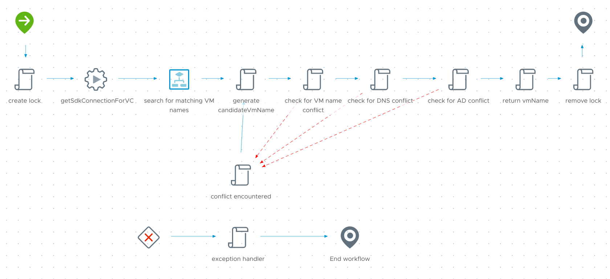

# Generate Unique Hostname workflow
Ensures a unique, sequentially-numbered hostname by checking for naming conflicts in vCenter, DNS, and Active Directory.

## Inputs/Outputs
| Name | Type | Direction | Description |
|:--- |:--- |:---|:---|
| `nameBase` | string | Input | letter-based portion of the VM naming format |
| `domain` | string | Input | domain name for checking DNS conflicts |
| `digits` | number | Input | optional manually-specified numbering suffix; overrides automatic numbering but still checks for conflicts |
| `vCenterName` | string | Input | FQDN of the owning vCenter |
| `vmName` | string | Output | generated VM name |

## Variables
| Name | Type | Value | Description |
|:--- |:--- |:--- |:--- |
| `adHost` | AD:AdHost | `[object AD:AdHost]` | host used by the AD plugin |
| `candidateVmName` | string | | holds the current working name during checks |
| `computerNames` | ConfigurationElement | `[object ConfigurationElement]` | vRO config element to keep track of the last-used number sequence for a given `nameBase` |
| `conflict` | boolean | `false` | gets set to true when a name conflict is encountered |
| `digitCount` | number | `2` | determines how many digits get appended to `nameBase` |
| `errMsg` | string | | thrown when errors are encountered |
|`hostnameSequence` | number | `0` | starts the sequence at 0, tracks as it changes |
| `vcSdkConnection` | VC:SdkConnection | | host used by the vCenter plugin (set based on `vCenterName` input) |
| `vms` | Array/VC:VirtualMachine | | holds VM objects to check for conflicts |