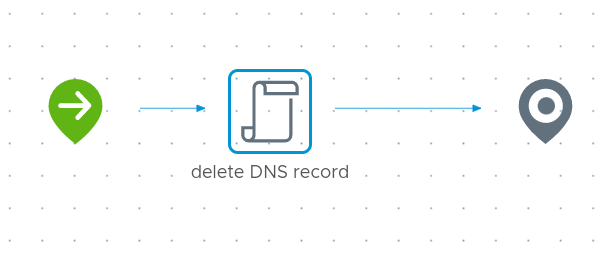

# VM Deprovision workflow
Performs cleanup tasks upon deployment deletion (currently just removing the static DNS record).

## Inputs/Outputs
| Name | Type | Direction | Description |
|:--- |:--- |:---|:---|
| `inputProperties` | Properties | Input | full request payload from vRA |

## Variables
| Name | Type | Value | Description |
|:--- |:--- |:--- |:--- |
| `dnsHost` | CompositeType(sshHost:string, sshUser:string, sshPass:SecureString, dnsServers:Array/string, supportedDomains:Array/string):dnsHost | `Endpoints: dnsHost` | object which stores endpoint and credential details for DNS operations |
