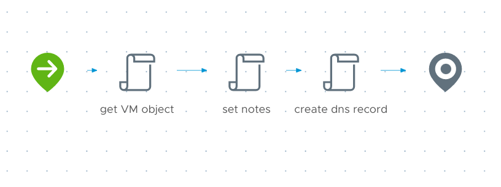

# VM Post-Provision workflow
Performs post-deploy tasks like adding notes to the VM object and creating static DNS records (if needed).

## Inputs/Outputs
| Name | Type | Direction | Description |
|:--- |:--- |:---|:---|
| `inputProperties` | Properties | Input | full request payload from vRA |

## Variables
| Name | Type | Value | Description |
|:--- |:--- |:--- |:--- |
| `vm` | VC:VirtualMachine| | virtual machine object |
| `dnsHost` | CompositeType(sshHost:string, sshUser:string, sshPass:SecureString, dnsServers:Array/string, supportedDomains:Array/string):dnsConfig | `Endpoints: dnsHost` | object which stores endpoint and credential details for DNS operations |
