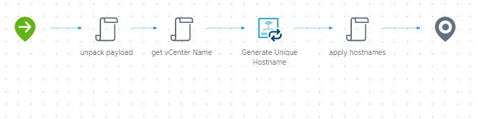

# VM Provision workflow
Wrapper workflow which unpacks the vRA request, identifies the target vCenter, calls [Generate Unique Hostname](../Generate%20Unique%20Hostname/) for each compute resource in the request, and returns the newly-generated names back to vRA so they get applied to the deployment.

## Inputs/Outputs
| Name | Type | Direction | Description |
|:--- |:--- |:---|:---|
| `inputProperties` | Properties | Input | full request payload from vRA |
| `resourceNames` | Array/string | Output | contains the newly-generated hostname(s) to return to vRA |
| `customProperties` | Properties | Output | modified to insert `vCenterName` and return back to vRA |

## Variables
| Name | Type | Value | Description |
|:--- |:--- |:--- |:--- |
| `digits` | number| | optional manually-specified numbering suffix; overrides automatic numbering but still checks for conflicts |
| `domain` | string | | domain used for DNS checks |
| `endpointId` | string | | vCenter identifier used internally by vRA |
| `nameBase` | string | | letter-based portion of the VM naming format |
| `newNames` | Array/string | | new names generated by `Generate Unique Hostname` |
| `originalNames` | Array/string | | original resource names |
|`vCenterName` | string | | fully-qualified vCenter name |